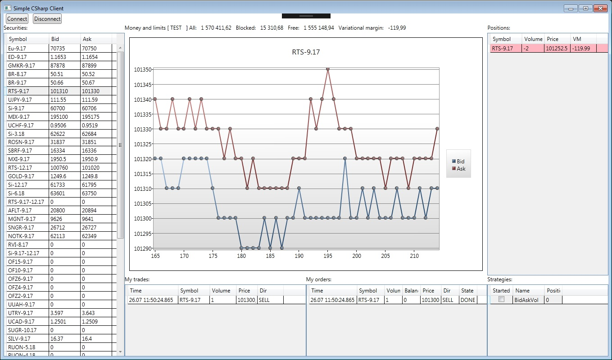

# CSharpClient 
---

It is a sample of implementation of C# client for SimpleCGate. 

## Functionality:

* retrieving all data from SimpleCGate
* controlling the connection / disconnection to the router.

Screenshot:

The project was created in the Visual Studio 2015.

ZeroMQ for .Net https://github.com/zeromq/netmq

Chart from MS WPF Toolkit.
